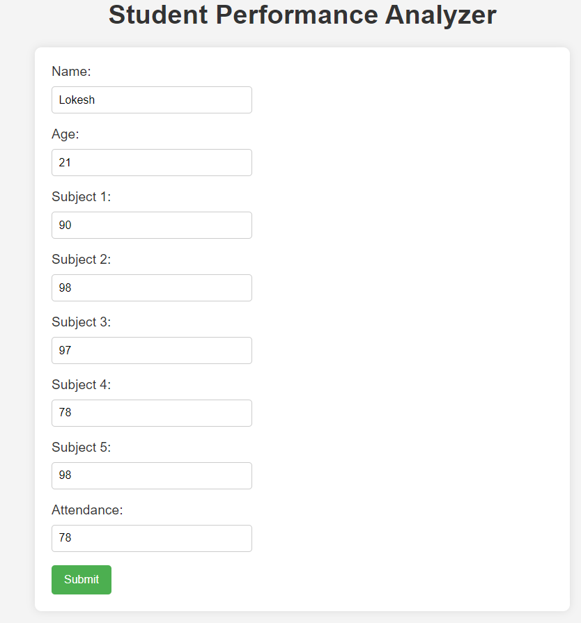
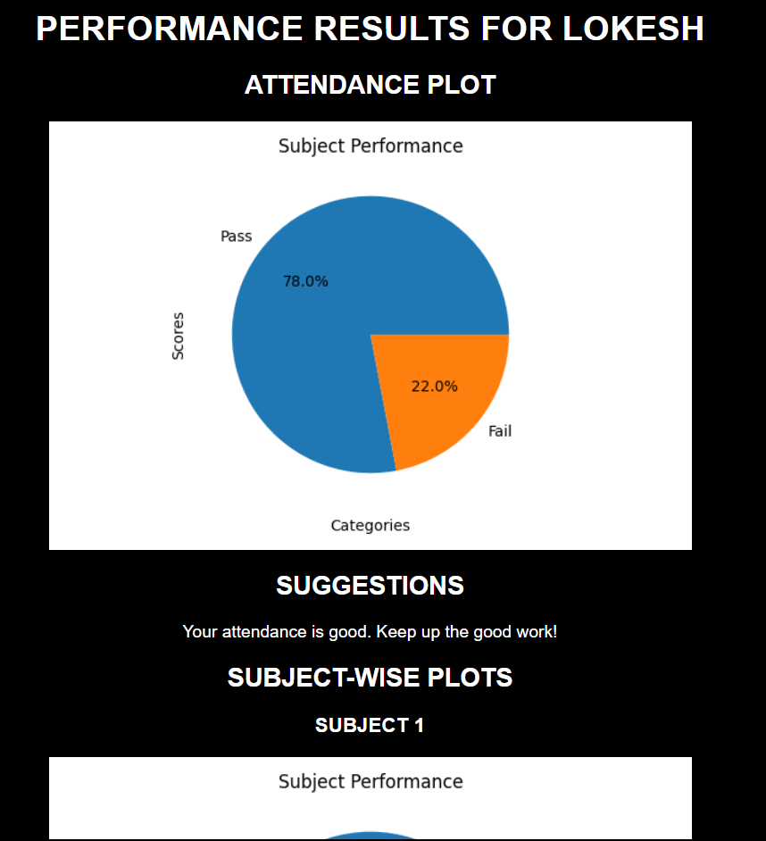

# Student Performance Analyzer

Student Performance Analyzer is a web application built with Flask that allows users to analyze and visualize student performance data.

## Table of Contents
1. [Introduction](#introduction)
2. [Installation](#installation)
3. [Usage](#usage)
4. [Credits](#credits)

## Introduction

This web application provides an interface for users to upload student performance data and view various analyses and visualizations based on that data. It helps students to understand progress and identify areas for improvement.

## Installation

To run the application locally, follow these steps:

1. Clone the repository:
    ```
    git clone https://github.com/lokesh-jonna/Student-Performance.git
    ```

2. Navigate to the project directory:
    ```
    cd Student-Performance
    ```

3. Install dependencies:
    ```
    pip install flask
    ```

4. Run the Flask application:
    ```
    python app.py
    ```

5. Access the application in your web browser at `http://localhost:5000`.

## Usage

1. Upload student performance data such as name,age and marks then submit.
2. Explore various analyses and visualizations, such as grade distributions, performance trends, and individual student profiles.

## Live 

[visit here ✨](https://jlokesh.pythonanywhere.com/)

<div class="row">
  <div class="column">
    
  </div>
  <div class="column">
    
  </div>
</div>


## Credits

This project was created by Lokesh and Nani as part of personal intereset.
